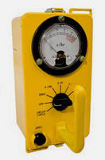
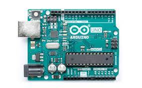
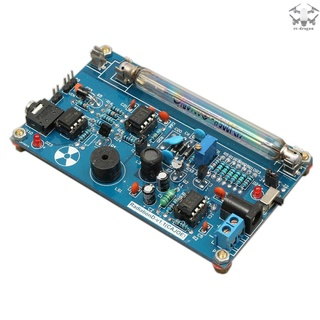
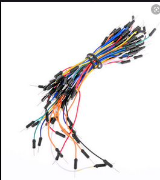
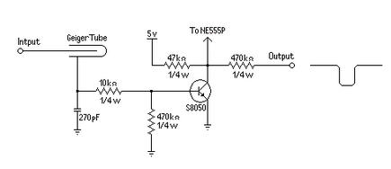
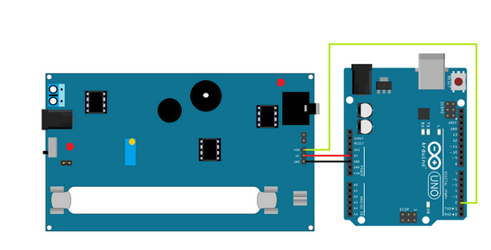

## Geiger-Muller

Bora medir radiação?!



## Uma breve introdução...

### O que é radiação?

"Em física, radiação é a propagação de energia de um ponto a outro, seja no vácuo ou em qualquer meio material, podendo ser classificada como energia em trânsito, e podendo ocorrer através de uma onda eletromagnética ou partícula." - Texto retirado da [Wikipedia](https://pt.wikipedia.org/wiki/Radia%C3%A7%C3%A3o).

### Radiação ionizante
"Radiação ionizante é a radiação que possui energia suficiente para ionizar átomos e moléculas, ou seja, é capaz de arrancar um elétron de um átomo ou molécula. " - Texto retirado da [Wikipedia](https://pt.wikipedia.org/wiki/Radia%C3%A7%C3%A3o_ionizante)

### Tipos de radiação que existem

| Radiação | Significado |
| ---------------- | ---------------------------------------------------------------------------------------------------------------------------------------- |
| Alfa             | Radiação nuclear ionizante que apresenta dois prótons e dois nêutrons                                                                    |
| Beta             | Elétrons sem massa e com carga menos um                                                                                                  |
| Gama             | Ondas eletromagnéticas com carga nula                                                                                                    |
| X                | Ondas eletromagnéticas que possuem a capacidade de atravessar corpos de baixa densidade e são absorvidos por materiais de densidade maior|

### Instrumento de Aferição

A principal função do contador de Geiger é detectar radiação na atmosfera,  ele foi criado em 1908 pelo físico alemão Johannes Hans Geiger com o intuito de medir os níveis de radiação em corpos e no ambiente. Sua constituição conta com um tubo de argônio que ao ser atravessado por partículas radioativas alfa e beta se ioniza, causando o fechamento do circuito elétrico e acionando o contador de radiação. Sua importância se deve ao fato de auxiliar o trabalho de profissionais que utilizam a radiação em tratamentos de saúde e ainda é essencial no estudo de acidentes nucleares.

### Unidade de medida (CPM)

## Como é que se faz um Contador Geiger?

Este site tem como proposição ensinar uma maneira de montar um simples contador Geiger utilizando a plataforma Arduino.

### Materiais

- Arduino UNO



- Módulo contador Geiger com Ampola



- x3 Jumpers



### Eletrônica

O componente de maior relevância para o projeto é o Módulo com Ampola, pois é essa ampola que permite a contagem da radiação do ambiente. Essa ampola consiste de um recipiente de vidro preenchido internamente por um gás inerte, o qual passa a conduzir eletricidade quando entra em contato com uma grande quantidade de energia, como as radiações alfa, beta e gama, por exemplo. Vale ressaltar que a maioria dos kits DIY (Faça Você Mesmo) já vêm com o circuito preparado de forma a facilitar a confecção de futuros projetos. Esse circuito elétrico instalado no módulo apresenta uma fonte de tensão, resistores, capacitores e transistores, como pode ser visualizado na seguinte representação:



A placa Arduino é responsável pela comunicação entre o circuito e o computador. Essa placa microcontroladora apresenta uma série de pinos de saída e de entrada, além de um processador capaz de rodar o código escrito. Nesse projeto, os pinos de 5V e o GND do Arduino serão ligados aos pinos de 5V e GND do módulo. Já o pino VIN do contador Geiger será ligado diretamente ao pino de interrupção D2 do Arduino.



O valor da radiação é contado em CPM e esse valor é exibido no monitor serial da IDE do Arduino.

### Código

- Declaração das variaveis

```cpp
#include <SPI.h>

#define LOG_PERIOD 15000     //Mínimo periodo em  millisegundos. Limite: 15000-60000.
#define MAX_PERIOD 60000    //Máximo periodo em  millisegundos
#define GM 2 //Pino do contador Geiger-Muller

unsigned long counts; //Realiza a contagem

unsigned long cpm;
unsigned int multiplier; 

unsigned long previousMillis;

void tube_impulse(){counts++;}
```

- Setup

```cpp
void setup() {
  //Seta as variaveis com os valores iniciais
  cpm = 0;
  counts = 0;
  previousMillis = 0;
  multiplier = MAX_PERIOD / LOG_PERIOD;         
  
  Serial.begin(9600);                                   

  pinMode(GM, INPUT);//Define o pino do módulo como 'input'(leitura)
  digitalWrite(GM, HIGH);//Define um valor inicial como ligado

  attachInterrupt(0, tube_impulse, FALLING);//Interrupção do pino do módulo 
}
```

- Main code

```cpp
void loop() {
  /*
    Caso não ocorra a interrupção e caso se o tempo decorrido seja superior ao valor minimo
    para o tempo necessário para contagem, é impresso o valor do CPM.
  */
  unsigned long currentMillis = millis();
  if (currentMillis - previousMillis > LOG_PERIOD) {
      previousMillis = currentMillis;
      cpm = counts * multiplier;

      Serial.print(cpm);
      Serial.write(' ');

      counts = 0;
  }
  
}
```
- [Código completo](https://github.com/Geiger-cnt/Geiger-cnt.github.io/blob/main/geiger/geiger.ino)
